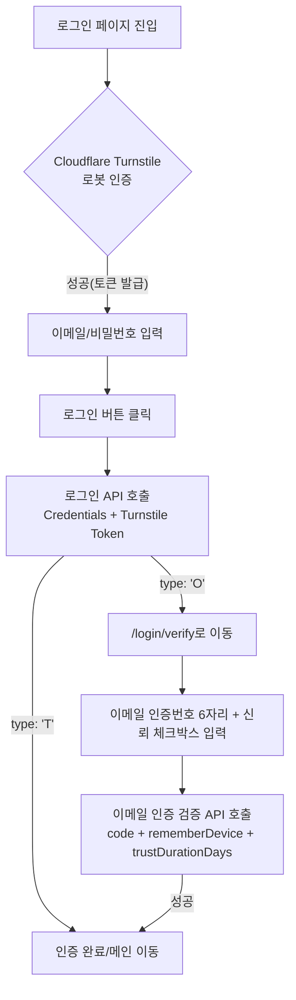

# 로그인 로직

본 문서는 서비스의 로그인 프로세스에 적용된 **보안 기술(Cloudflare Turnstile)**, **신규 기기 판별(device-trust 쿠키)**, 그리고 **인증(JWT Token)** 로직에 대해 설명합니다.

> **주요 관련 파일**
>
> - `src/pages/LoginPage.tsx`: 자격증명 로그인 UI, Turnstile, 신규 기기 판별 결과 분기
> - `src/pages/EmailVerificationPage.tsx`: 신규 기기(브라우저) 이메일 인증 UI (`/login/verify`)
> - `src/stores/loginFlowStore.ts`: 로그인 → 이메일 인증 사이 상태 전달 (비영속)
> - `src/api/user.ts`: 로그인 및 이메일 인증 검증 API
> - `src/stores/authStore.ts`: 인증 상태 관리 (Zustand)

---

## 1. 로그인 전체 프로세스 (Flow)

로그인은 크게 **봇 차단 → 자격증명 확인 → (신규 기기인 경우) 이메일 인증** 순서로 진행됩니다.



---

## 2. 봇 차단 (Cloudflare Turnstile)

악의적인 자동화 공격(Brute-force)을 방지하기 위해 사용합니다.

### 2.1 동작 방식

1. **클라이언트 검증**: 사용자가 페이지에 접속하면 위젯이 브라우저 환경을 분석합니다.
2. **Success 표시**: Cloudflare 자체 검증이 완료되면 UI에 체크 표시가 나타나며 클라이언트용 `token`이 발급됩니다.
3. **서버 검증 (중요)**: 로그인 API 호출 시 이 `token`을 백엔드로 전송하며, 백엔드는 Cloudflare API와 통신하여 해당 토큰의 유효성을 최종 확인합니다.

### 2.2 [미구현/추후 구현 필요] 백엔드 연동

현재 UI에서 **"Success"**가 뜨는 것은 **클라이언트와 Cloudflare 간의 확인**일 뿐입니다. 보안을 완성하려면 다음 작업이 필요합니다:

- [ ] **백엔드 검증**: 로그인 API 요청 시 전달된 `cfTurnstileResponse` 값을 백엔드가 수신하여 Cloudflare 서버(`siteverify` API)에 토큰 유효성을 질의해야 합니다.
- [ ] **에러 처리**: 백엔드에서 토큰 검증 실패 시, 적절한 에러 코드를 반환하고 클라이언트는 위젯을 새로고침하거나 안내 메시지를 띄워야 합니다.

---

## 3. 신규 기기 판별 (Device Trust)

같은 계정이라도 **처음 접속하는 기기(브라우저)**인지를 서버가 판단하여 보안을 강화합니다. 서버가 `type: 'O'`를 반환하면 추가 이메일 인증을 요구합니다.

이 판별은 클라이언트가 스스로 계산하는 값이 아니라, **백엔드가 발급·관리하는 device-trust 쿠키**를 기준으로 합니다. PC/태블릿/모바일 웹앱 등 플랫폼에 따라 동작이 달라지지 않고, 서버가 발급/폐기 권한을 가지므로 신뢰 판단 근거로 삼기에 적합합니다.

### 3.1 방식: device-trust 쿠키

**정책**: 이메일 인증(`EmailVerificationPage`)에서 사용자가 "이 브라우저를 30일동안 신뢰" 체크박스를 선택하고 인증에 성공하면, 백엔드가 device-trust 쿠키를 발급합니다. 이후 같은 브라우저로 로그인하면 이 쿠키가 요청에 자동으로 포함되어 `type: 'T'`로 즉시 통과됩니다. 쿠키가 없거나 만료됐으면 `type: 'O'`로 이메일 인증을 다시 요구합니다.

| 항목        | 내용                                                                                       |
| ----------- | ------------------------------------------------------------------------------------------ |
| 발급 시점   | `/user/email-verification-login` 성공 + `rememberDevice: true`                             |
| 유효기간    | 요청 body의 `trustDurationDays`(현재 프론트 상수값 30) — UI 체크박스 라벨과 항상 동일한 값 |
| 형태        | `Set-Cookie` (httpOnly + Secure + SameSite=Lax, Max-Age = `trustDurationDays` × 86400초)   |
| 판단 주체   | 100% 백엔드 — 프론트는 쿠키를 읽거나 만들지 않는다(브라우저가 요청에 자동 첨부)            |
| 프론트 역할 | `EmailVerificationLoginRequest.rememberDevice`/`trustDurationDays` 값을 전달하는 것뿐      |

> **백엔드 필요 계약** (프론트에서 코드로 구현할 수 없는 부분):
>
> - `/user/email-verification-login` 성공 시 `rememberDevice === true`면 `trustDurationDays`(일) × 86400(초)를 Max-Age로 하는 쿠키를 `Set-Cookie`로 발급. `false`면 발급하지 않음(또는 세션 쿠키만).
> - `/user/login` 요청 시 유효한 device-trust 쿠키가 함께 전송되면 `type: 'T'`, 없거나 만료됐으면 `type: 'O'`.
> - CORS: 프론트/API가 서로 다른 origin(서브도메인)이라면 `Access-Control-Allow-Credentials: true` + 명시적 origin 설정 필요(와일드카드 불가). 프론트는 이미 `credentials: 'include'`를 보내도록 반영해둠(`src/api/index.ts`).

### 서버 전달 방법

프론트는 별도 식별값을 계산하지 않는다 — `fetch()`에 `credentials: 'include'`만 설정되어 있으면 브라우저가 쿠키를 자동으로 실어 보낸다. 신뢰 여부와 유효기간은 이메일 인증 제출 시 body로 명시적으로 전달한다.

```ts
// src/pages/EmailVerificationPage.tsx
const TRUST_DEVICE_DURATION_DAYS = 30 // 체크박스 라벨과 request data가 항상 같은 값을 쓰도록 상수로 관리

emailCodeLoginMutation.mutate({
  code: emailCode,
  email: pending.email,
  rememberDevice: trustDevice,
  trustDurationDays: TRUST_DEVICE_DURATION_DAYS,
})
// → loginWithEmailVerificationCode({ email, code, rememberDevice, trustDurationDays })
// → api.post('/user/email-verification-login', body, { skipAuth: true })
```

---

## 4. 토큰 관리 (JWT)

성공적으로 인증된 사용자의 세션을 유지하기 위해 사용합니다.

### 4.1 저장소

- `sessionStorage` (브라우저 종료 시 삭제되도록 설정하여 보안 강화)

### 4.2 401 응답 시 자동 로그아웃

```ts
// src/api/index.ts
if (res.status === 401) {
  const msg = json.message?.[0]
  if (msg.includes('만료') || msg.includes('expired')) {
    sessionStorage.removeItem('accessToken')
    window.location.replace('/login') // 라우터 우회 하드 리다이렉트
  }
  throw new ApiError(msg, 401)
}
```

- 만료 메시지가 포함된 401에만 자동 로그아웃이 동작합니다.
- 일반 401(잘못된 자격증명 등)은 에러만 throw하고 리다이렉트하지 않습니다.

### 4.3 라우트 진입 시 유효성 검사

`src/utils/requireAuth.ts` — TanStack Router의 `beforeLoad`에서 `isAuthValid()`를 호출합니다.

1. `sessionStorage`에 'accessToken' 존재 여부 확인
2. JWT 형식 유효성 확인 (점으로 구분된 3파트인지)
3. `exp` 만료 여부 확인 → 만료 시 `sessionStorage`에서 토큰 삭제 후 `/login` 리다이렉트

---

## 5. 핵심 보안 체크리스트 (요약)

| 항목                                      |        구현 상태        | 비고                                        |
| :---------------------------------------- | :---------------------: | :------------------------------------------ |
| **Turnstile UI 배치**                     |         ✅ 완료         | 비밀번호 입력란 아래, 로그인 버튼 바로 위   |
| **Turnstile 클라이언트 토큰 획득**        |         ✅ 완료         | `onSuccess` 콜백을 통한 상태 저장           |
| **백엔드 Turnstile 최종 검증**            |    🛠 **진행 예정**     | 백엔드 API와의 스펙 조율 필요               |
| **신규 기기 판별 → 이메일 인증 라우팅**   |         ✅ 완료         | `/login/verify`, 5분 제한 시간 적용         |
| **rememberDevice/trustDurationDays 전달** |         ✅ 완료         | request data로 전달까지는 프론트 완료       |
| **device-trust 쿠키 발급/판단**           | 🛠 **백엔드 협의 필요** | 위 값을 받아 실제 쿠키를 발급/검증하는 로직 |

---

## 6. 백엔드 연동 시 체크리스트

현재 `src/pages/LoginPage.tsx`, `src/pages/EmailVerificationPage.tsx`는 `[TEMP] 26.07.27` 주석으로 실제 API 호출을 막고, 항상 성공 응답을 반환하는 `createTempAccessToken()`(`src/utils/tempAccessToken.ts`) 스텁으로 대체되어 있습니다. `/user/login`, `/user/email-verification-login` 백엔드 구현(device-trust 쿠키 발급/판단 포함)이 완료되면 다음을 진행합니다.

- [ ] `src/pages/LoginPage.tsx`, `src/pages/EmailVerificationPage.tsx`: `[TEMP]` 주석 블록 전체 해제, `createTempAccessToken()`(`src/utils/tempAccessToken.ts`) 호출부 제거
- [ ] `src/pages/LoginPage.test.tsx`, `src/pages/EmailVerificationPage.test.tsx`: `TEMP:` 테스트(항상 성공 가정) 삭제, `[FUTURE WORK]` 주석 블록 해제
- [ ] 2.2절의 Cloudflare Turnstile `siteverify` 백엔드 검증 연동 확인
- [ ] `src/api/index.ts`의 `credentials: 'include'`가 실제 배포 환경(same-origin/cross-origin)에서 의도대로 동작하는지 확인
- [ ] `pnpm type-check` / `pnpm test --run` / `pnpm lint` 로 회귀 확인
