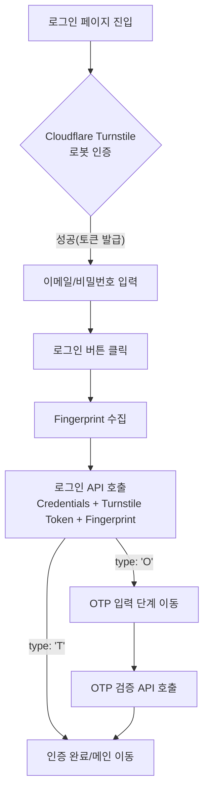

# 로그인 로직

본 문서는 서비스의 로그인 프로세스에 적용된 **보안 기술(Cloudflare Turnstile)**, **기기 식별(Fingerprint)**, 그리고 **인증(JWT Token)** 로직에 대해 설명합니다.

> **주요 관련 파일**
>
> - `src/pages/LoginPage.tsx`: 로그인 UI 및 전체 인증 흐름 제어
> - `src/utils/fingerprint.ts`: 브라우저 핑거프린트 수집 (FingerprintJS)
> - `src/api/user.ts`: 로그인 및 OTP 검증 API
> - `src/stores/authStore.ts`: 인증 상태 관리 (Zustand)

---

## 1. 로그인 전체 프로세스 (Flow)

로그인은 크게 **봇 차단 → 자격증명 확인 → 기기 식별/OTP** 순서로 진행됩니다.



---

## 2. 봇 차단 (Cloudflare Turnstile)

악의적인 자동화 공격(Brute-force)을 방지하기 위해 사용합니다.

### 2.1 동작 방식

1. **클라이언트 검증**: 사용자가 페이지에 접속하면 위젯이 브라우저 환경을 분석합니다.
2. **Success 표시**: Cloudflare 자체 검증이 완료되면 UI에 체크 표시가 나타나며 클라이언트용 `token`이 발급됩니다.
3. **서버 검증 (중요)**: 로그인 API 호출 시 이 `token`을 백엔드로 전송하며, 백엔드는 Cloudflare API와 통신하여 해당 토큰의 유효성을 최종 확인합니다.

### 2.2 [미구현/추후 구현 필요] 백엔드 연동

현재 UI에서 **"Success"**가 뜨는 것은 **클라이언트와 Cloudflare 간의 확인**일 뿐입니다. 보안을 완성하려면 다음 작업이 필요합니다:

- [ ] **백엔드 검증**: 로그인 API 요청 시 전달된 `cfTurnstileResponse` 값을 백엔드가 수신하여 Cloudflare 서버(`siteverify` API)에 토큰 유효성을 질의해야 합니다.
- [ ] **에러 처리**: 백엔드에서 토큰 검증 실패 시, 적절한 에러 코드를 반환하고 클라이언트는 위젯을 새로고침하거나 안내 메시지를 띄워야 합니다.

---

## 3. 기기 식별 (Fingerprint)

같은 계정이라도 **처음 접속하는 기기**인지를 서버가 판단하여 보안을 강화합니다. 서버가 `type: 'O'`를 반환하면 추가 OTP 인증을 요구합니다.

| 항목        | 내용                                                           |
| :---------- | :------------------------------------------------------------- |
| 라이브러리  | `@fingerprintjs/fingerprintjs` (오픈소스)                      |
| 결과값      | `visitorId` — 브라우저/OS/하드웨어 환경을 조합한 해시 문자열   |
| 실패 처리   | `null` 반환, 로그인은 계속 진행                                |
| 초기화 시점 | 모듈 import 시점 (렌더 이전), 로그인 버튼 클릭 시 `await`만 함 |

### 서버 전달 방법

`KPMFP`라는 커스텀 HTTP 헤더로 전달합니다.

```ts
// src/pages/LoginPage.tsx
const fp = await getFingerprint()
fingerprintRef.current = fp // Step 2(OTP)에서도 재사용

login({ email, password, deviceType }, fp)
// → api.post('/user/login', body, { extraHeaders: { KPMFP: fp } })
```

> **`fingerprintRef`를 사용하는 이유**: Step 1에서 수집한 값을 Step 2(OTP)에서도 그대로 재사용해야 하므로, 리렌더에 영향받지 않는 `useRef`에 저장합니다.

---

## 4. 토큰 관리 (JWT)

성공적으로 인증된 사용자의 세션을 유지하기 위해 사용합니다.

### 4.1 저장소

- `sessionStorage` (브라우저 종료 시 삭제되도록 설정하여 보안 강화)

### 4.2 401 응답 시 자동 로그아웃

```ts
// src/api/index.ts
if (res.status === 401) {
  const msg = json.error?.[0]
  if (msg.includes('만료') || msg.includes('expired')) {
    sessionStorage.removeItem('accessToken')
    window.location.replace('/login') // 라우터 우회 하드 리다이렉트
  }
  throw new ApiError(msg, 401)
}
```

- 만료 메시지가 포함된 401에만 자동 로그아웃이 동작합니다.
- 일반 401(잘못된 자격증명 등)은 에러만 throw하고 리다이렉트하지 않습니다.

### 4.3 라우트 진입 시 유효성 검사

`src/utils/requireAuth.ts` — TanStack Router의 `beforeLoad`에서 `isAuthValid()`를 호출합니다.

1. `sessionStorage`에 'accessToken' 존재 여부 확인
2. JWT 형식 유효성 확인 (점으로 구분된 3파트인지)
3. `exp` 만료 여부 확인 → 만료 시 `sessionStorage`에서 토큰 삭제 후 `/login` 리다이렉트

---

## 5. 핵심 보안 체크리스트 (요약)

| 항목                               |    구현 상태     | 비고                                      |
| :--------------------------------- | :--------------: | :---------------------------------------- |
| **Turnstile UI 배치**              |     ✅ 완료      | 비밀번호 입력란 아래, 로그인 버튼 바로 위 |
| **Fingerprint 수집/전송**          |     ✅ 완료      | API 헤더 `KPMFP` 사용                     |
| **Turnstile 클라이언트 토큰 획득** |     ✅ 완료      | `onSuccess` 콜백을 통한 상태 저장         |
| **백엔드 Turnstile 최종 검증**     | 🛠 **진행 예정** | 백엔드 API와의 스펙 조율 필요             |
| **OTP 타이머 및 유효성**           |     ✅ 완료      | 5분 제한 시간 적용                        |
